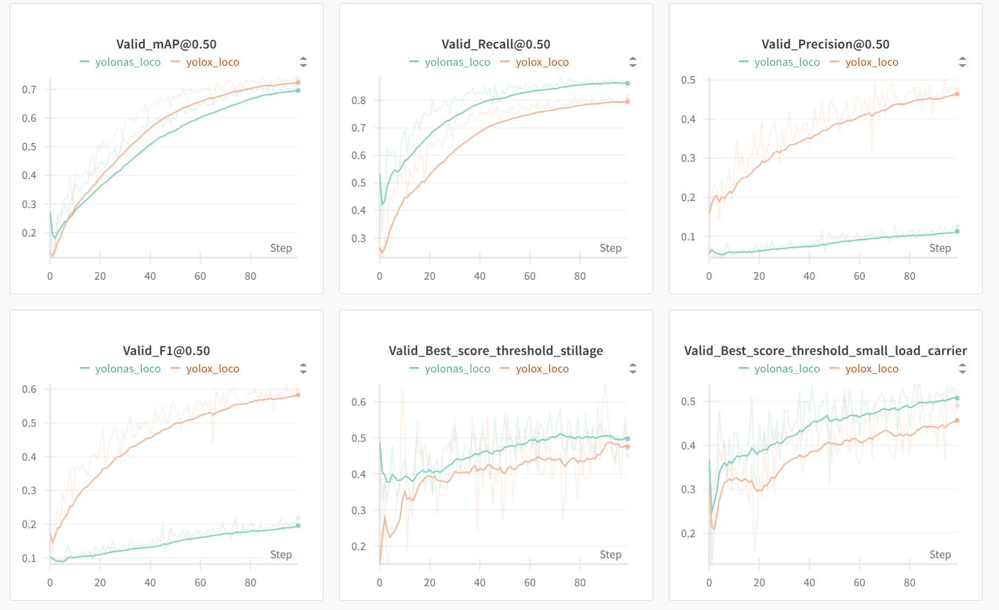

# Warehouse Object Detection

This report covers technical guide for our course project. For details on dataset and 3D object detection preresearch refer to [this report](https://pinnate-legume-751.notion.site/Warehouse-Object-Detection-1f29ea9ac91780bf90a9dad47145b7f5?pvs=4)

## Data Acquisition and Transformation

We used LOCO dataset, explained in the corresponding [paper+repository](https://github.com/tum-fml/loco).

To download the dataset, run the following command:

```bash
mkdir data
cd data
wget https://go.mytum.de/239870 -O LOCO.zip  # images
unzip LOCO.zip
rm LOCO.zip
cd dataset
wget wget https://raw.githubusercontent.com/tum-fml/loco/refs/heads/main/rgb/loco-all-v1.json  # annotations
```

Then, to flatten subfolders and make the dataset easier to use with different COCO parsers, run custom preprocessing script:

```bash
python stratify_loco.py ../data/dataset/loco-all-v1.json \
    --images-dir ../data/loco \
    --output-dir ../data/loco_processed/
```

This will create a new folder `loco_processed` with the following structure:

```
loco_processed/
├── images
│   ├── train
│   ├── val
│   └── test
├── train.json
├── val.json
└── test.json
```

Seed is fixed for reproducibility. Resulting data is still in COCO format with category ids remapped from 3, 5, 7, 10, 11 to 0, 1, 2, 3, 4 for compatibility with RT-DETR and D-FINE.

### Depth Integration

First of all, run 

```bash
pip install -r requirements.txt
```

To make use of possibly available depth data, we created a script to dim/highlight far objects in the image. Use depth_strength > 0 to highlight far objects, and < 0 to dim them.

Usage:

```bash
python scripts/depth_mult.py \
    --input_folder data/loco_processed/images/val \
    --output_folder data/loco_depth_mult_inv/images/val
    --depth_strength -1.0
```

## Training

### YOLO-NAS and YOLO X

This models are trained using [train.py](./train.py) script that wraps super-gradients training pipeline. To train YOLO-NAS, run the following command:

```bash
python train.py model=yolonas logging.run_name="yolonas_loco"
```

To train YOLO X, run the following command:

```bash
python train.py model=yolox logging.run_name="yolox_loco"
```

Keep in mind, that the full config is located in [configs/config.yaml](./configs/config.yaml) and separate models are configured in their own files in [configs/models](./configs/models) folder. By default, we use `M` model versions, but this can be easily changed in the config file or in the command line.

Both YOLO-NAS and YOLO X log the information to the wandb, making it easy to see the training process as shown below. 



### RT-DETR

We tried launching RT-DETR using huggingface transformers library, but we've encountered some bugs in image processing and metrics calculation. Therefore, we decided to use the original repository. To train RT-DETR, first, copy the repositorry to the `RT-DETR` folder:

```bash
cd models
git clone git@github.com:lyuwenyu/RT-DETR.git
cd RT-DETR
```

Then, fix multiple deprecated names in the code such as 

(import torchvision.transforms.v2 as T)

+ T.ToImageTensor -> T.ToImage
+ T.ConvertDtype-> T.ConvertImageDtype
+ T.SanitizeBoundingBox -> T.SanitizeBoundingBoxes
+ from torchvision import datapoints -> from torchvision import tv_tensors
+ datapoints.BoundingBox -> tv_tensors.BoundingBoxes
+ spatial_size -> canvas_size (everywhere in context of tv_tensors.BoundingBoxes)

Overall, the code is relatively old, so this renaming is required. However, renaming is enough to get the code running even on 2025 RTX 5080 and PyTorch 2.7.0 + CUDA 12.8.

To train the model on LOCO dataset, copy our custom config files to corresponding `RT-DETR` destination folders:

```bash
cp configs/RT-DETR/coco_detection.yml \
    models/RT-DETR/rtdetr_pytorch/configs/dataset
cp configs/RT-DETR/dataloader.yml \
    models/RT-DETR/rtdetr_pytorch/configs/rtdetr/include
cp configs/RT-DETR/optimizer.yml \
    models/RT-DETR/rtdetr_pytorch/configs/rtdetr/include
cp configs/RT-DETR/rtdetr_r18vd_6x_coco.yml \
    models/RT-DETR/rtdetr_pytorch/configs/rtdetr
```

This makes the model train 100 epochs instead of 72, adjusts batch size to fit 16GB GPU, and uses our custom dataset with custom number of classes.

Sadly, back in 2022, WandB was not so popular. Or, the authors wanted to make you learn paddle-paddle to use WandB, because pytorch version of RT-DETR does not support WandB logging and logs are output to the console only.
To train the model, run the following command:

```bash
python tools/train.py -c configs/rtdetr/rtdetr_r18vd_6x_coco.yml
```

Note that `os.environ['CUDA_LAUNCH_BLOCKING'] = '1'  # https://github.com/Peterande/D-FINE/issues/10` at the beginning of the training script of RT-DETR and D-FINE may resolve strange CUDA errors. 

### D-FINE
D-FINE is basically an extension of RT-DETR released in 2025, so there were no issues with running it out of the box.
First, clone the repository:

```bash
git clone git@github.com:Peterande/D-FINE.git
```

Then, copy our custom config files to corresponding `D-FINE` destination folders:

```bash
cp configs/D-FINE/dataloader.yml \
    models/D-FINE/configs/dfine/include
cp configs/D-FINE/dfine_hgnetv2_m_loco.yml \
    models/D-FINE/configs/dfine/custom
cp configs/D-FINE/loco_detection.yml \
    models/D-FINE/configs/dataset
cp configs/D-FINE/runtime.yml \
    models/D-FINE/configs
```

This makes the model train 100 epochs instead of 132, again, adjusts batch size to fit 16GB GPU, and uses our custom dataset with custom number of classes.

To train the model, run the following command:

```bash
cd models/D-FINE
python train.py -c configs/dfine/custom/dfine_hgnetv2_m_loco.yml --use-amp --seed=42
```

The metrics logged to WandB are slightly different from YOLOs, but the overall spirit remains.

## Inference

Some of the test images are visualized in the aforementioned [report](https://pinnate-legume-751.notion.site/Warehouse-Object-Detection-1f29ea9ac91780bf90a9dad47145b7f5?pvs=4). The inference is done using the same models as training, but with different scripts.

### YOLO-NAS and YOLO X

To run inference on YOLO-NAS and YOLO X, use our [inference.py](./inference.py) script.

```bash
python inference.py \
    --model-type yolox \
    --model-size m \
    --checkpoint ckpt/yolox_m/ckpt_best.pth \
    --input data/loco_processed/images/test \
    --output outputs/yolox_demo
```

This would run inference on the test set and save the annotated images to the `outputs/yolox_demo` folder.

### RT-DETR and D-FINE

To run inference on RT-DETR and D-FINE, use repositorys' `tools/inference/torch_inf.py` script. It does exactly the same to RT-DETR and D-FINE as our `inference.py` does to YOLOs. We slightly modify it to increase bounding box thickness and work well on image folders instead of single images.

```bash
python tools/inference/torch_inf.py \
    -c configs/dfine/custom/dfine_hgnetv2_m_loco.yml \
    -r ../../ckpt/dfine_hgnetv2_m_custom/best_stg1.pth \
    --input ../../data/loco_processed/images/test \
    --output ../../outputs/d-fine_demo \
    --device cuda:0 \
    --show-dir ../../outputs/d-fine_demo \
```
